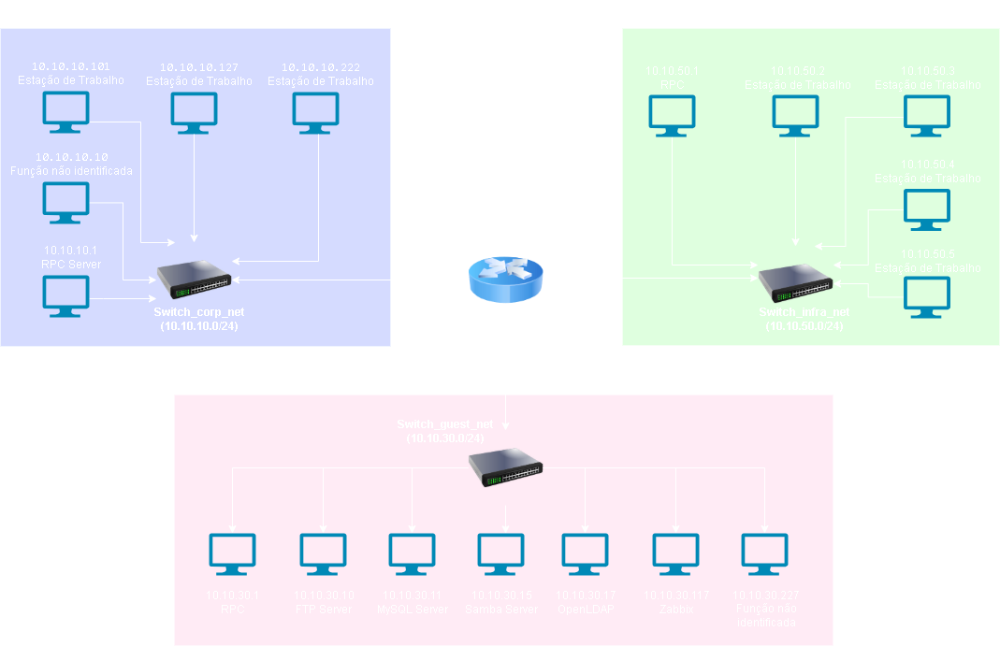

# Relatório Técnico de Análise de Rede

Redes analisadas: `10.10.10.0/24`, `10.10.30.0/24`, `10.10.50.0/24`  
Data: Julho de 2025  
Responsável: Hannah Brito  
Versão: 1.0


## Sumário

1. [Reconhecimento Inicial](#reconhecimento-inicial)\
   1.1 Configuração de Rede\
   1.2 Descoberta de Hosts

2. [Varredura Detalhada (Nmap)](#varredura-detalhada-nmap)\
   2.1 Serviços Identificados por Host

3. [Identificação de Ativos](#identificação-de-ativos)\
   3.1 Classificação Funcional

4. [Avaliação de Riscos](#avaliação-de-riscos)\
   4.1 Serviços Desnecessários\
   4.2 Portas sem Autenticação\
   4.3 Segmentação de Rede

5. [Diagrama da Rede](#diagrama-da-rede)

6. [Achados e Recomendações](#achados--recomendações)\
   6.1 Achados\
   6.2 Recomendações

7. [Plano de Ação](#plano-de-ação)


### Sumário Executivo

Este relatório apresenta os resultados da análise de rede realizada em um ambiente composto por três sub-redes: `10.10.10.0/24`, `10.10.30.0/24` e `10.10.50.0/24`. A atividade teve como objetivo identificar ativos, detectar serviços em execução, avaliar riscos relacionados à exposição de portas e serviços, e propor recomendações práticas para mitigação.

Durante a varredura, foram identificados diversos serviços em execução em servidores de banco de dados, autenticação, arquivos, monitoramento e FTP. Notou-se a presença de serviços legados como RPCBind e FTP sem criptografia, além de serviços críticos operando sem mecanismos de proteção (ex: HTTP e LDAP em texto claro).

A análise revelou ausência de segmentação lógica, o que aumenta significativamente a superfície de ataque. Todos os ativos, incluindo servidores sensíveis, estão acessíveis a partir de redes menos confiáveis, como a rede de estações de trabalho.

As principais recomendações incluem:

- Implementação de segmentação de rede via VLANs e ACLs
- Adoção de protocolos seguros (LDAPS, HTTPS, SFTP)
- Desativação ou restrição de serviços desnecessários
- Fortalecimento do monitoramento contínuo da infraestrutura

Um plano de ação baseado em impacto e facilidade foi elaborado, priorizando ações de alto valor com implementação viável a curto prazo.

| Nome Estimado | Subnet Descoberta  | Finalidade Suposta                          |
|---------------|--------------------|---------------------------------------------|
| corp_net      | 10.10.10.0/24      | Rede corporativa (estações e web server)    |
| guest_net     | 10.10.30.0/24      | Rede de visitantes e dispositivos pessoais  |
| infra_net     | 10.10.50.0/24      | Rede de infraestrutura crítica (servidores) |


### Reconhecimento Inicial

**Configuração de Rede:**
Foi criado um script para escanear todos as redes buscando os hosts conectados. 
Visualize a análise em anexos/escaneamento_redes_automatizado.

```bash
┌──(rootㇿ281ff6fd5e61)-[/home/analyst]
└─# ip addr
2: eth0@if23: inet 10.10.10.2/24
3: eth1@if32: inet 10.10.50.6/24
4: eth2@if33: inet 10.10.30.2/24
```

**Descoberta de Hosts:**
Foi criado um script para escanear todos os hosts buscando informações sobre as portas e serviços. 
Visualize a análise em anexos/escaneamento_servicos_automatizado.

**Rede 10.10.10.0/24:**

- 10.10.10.1
- 10.10.10.10
- 10.10.10.101 — WS\_002.projeto\_final\_opcao\_1\_corp\_net
- 10.10.10.127
- 10.10.10.222

**Rede 10.10.50.0/24:**

- 10.10.50.1
- 10.10.50.2
- 10.10.50.3
- 10.10.50.4
- 10.10.50.5

**Rede 10.10.30.0/24:**

- 10.10.30.1
- 10.10.30.10 — ftp-server.projeto\_final\_opcao\_1\_infra\_net
- 10.10.30.11 — mysql-server.projeto\_final\_opcao\_1\_infra\_net
- 10.10.30.15 — samba-server.projeto\_final\_opcao\_1\_infra\_net
- 10.10.30.17 — openldap.projeto\_final\_opcao\_1\_infra\_net
- 10.10.30.117 — zabbix-server.projeto\_final\_opcao\_1\_infra\_net
- 10.10.30.227

---

**Exemplo de Varredura com Nmap:**

```bash
# Escaneamento completo da rede
nmap -sV -p- 10.10.30.0/24

# Verificando serviços detalhados do host Zabbix
nmap -sV -p 80,10051,10052 10.10.30.117
```

### Varredura Detalhada (Nmap)

**10.10.10.1**

- 111/tcp — RPCBind (versão 2–4)
- 36623/tcp — RPC Status (versão 1)

**10.10.30.1**

- 111/tcp — RPCBind (versão 2–4)
- 36623/tcp — RPC Status (versão 1)

**10.10.30.10** — FTP Server

- 21/tcp — FTP (Pure-FTPd)
- Observação: possível acesso anônimo

**10.10.30.11** — MySQL Server

- 3306/tcp — MySQL (v8.0.43)
- 33060/tcp — MySQL X Protocol

**10.10.30.15** — Samba Server

- 139/tcp e 445/tcp — SMB (Samba 4)

**10.10.30.17** — OpenLDAP

- 389/tcp — LDAP (OpenLDAP 2.2.X – 2.3.X)
- 636/tcp — LDAPS (seguro)

**10.10.30.117** — Zabbix Server

- 80/tcp — HTTP (nginx)
- 10051/tcp — Zabbix Trapper (SSL)
- 10052/tcp — Desconhecido

**10.10.50.1** — RPC Server

- 111/tcp — RPCBind (versão 2–4)
- 36623/tcp — RPC Status (versão 1)


### Identificação de Ativos

| IP           | Nome DNS                                    | Função                   | Justificativa                        |
| ------------ | ------------------------------------------- | ------------------------ | ------------------------------------ |
| 10.10.10.1   | –                                           | Servidor RPC             | Serviços RPC padrão                  |
| 10.10.10.101 | WS\_002.projeto\_final\_opcao\_1\_corp\_net | Estação de Trabalho      | Todas portas fechadas                |
| 10.10.30.1   | –                                           | Servidor RPC             | RPCBind e RPC Status abertos         |
| 10.10.30.10  | ftp-server...infra\_net                     | Servidor FTP             | Porta 21 aberta com Pure-FTPd        |
| 10.10.30.11  | mysql-server...infra\_net                   | Banco de Dados           | MySQL nas portas 3306 e 33060        |
| 10.10.30.15  | samba-server...infra\_net                   | Servidor de Arquivos     | Samba nas portas 139 e 445           |
| 10.10.30.17  | openldap...infra\_net                       | Servidor de Autenticação | LDAP nas portas 389 e 636            |
| 10.10.30.117 | zabbix-server...infra\_net                  | Monitoramento            | HTTP e Zabbix Trap abertos           |
| 10.10.50.1   | –                                           | Servidor RPC             | Mesmo padrão de RPC das outras redes |

---

### Avaliação de Riscos

**Serviços desnecessários:**

- RPCBind e RPC Status (em vários hosts): avaliar uso real

**Portas sem autenticação/seguras:**

- FTP (10.10.30.10): verificar se aceita anônimo e desativar uploads
- HTTP (10.10.30.117): trafega sem criptografia
- LDAP (389): protocolo em texto claro

**Segmentação lógica ausente:**

- Hosts críticos da 10.10.30.x acessíveis a partir de qualquer rede
- Estações de trabalho e servidores compartilham plano de rede


### Diagrama da Rede



### Achados + Recomendações

**Achados:**

| Risco                         | Severidade |  Facilidade de Correção |  Status Atual   |
|-------------------------------|------------|-------------------------|-----------------|
| Falta de segmentação de rede  | 🚨 Alta    | 🛠️ Média                | 🌐 Exposto     |
| LDAP sem criptografia         | 🚨 Alta    | 🛠️ Média                | 🔓 Porta 389   |
| FTP sem autenticação segura   | ⚠️ Média   | 🛠️ Alta                 | 🌐 Exposto     |
| HTTP sem HTTPS (Zabbix)       | ⚠️ Média   | 🛠️ Alta                 | 🌐 Exposto     |

**Recomendações:**

- Implementar VLANs e ACLs para isolar servidores
- Restringir ou desativar serviços RPC desnecessários
- Usar LDAP com TLS (LDAPS)
- Migrar FTP para FTPS ou SFTP
- Adicionar HTTPS ao Zabbix
- Monitoramento contínuo

### Plano de Ação

| Ação                               | Impacto | Facilidade | Prioridade |
| ---------------------------------- | ------- | ---------- | ---------- |
| Segmentar redes (VLAN/firewall)    | Alto    | Médio      | Alta       |
| LDAP via TLS (porta 636)           | Alto    | Médio      | Alta       |
| Restringir serviços RPC            | Médio   | Médio      | Média      |
| Configurar FTP seguro              | Médio   | Médio      | Média      |
| Adicionar HTTPS ao Zabbix          | Médio   | Baixo      | Média      |
| Implementar monitoramento contínuo | Alto    | Variável   | Alta       |
